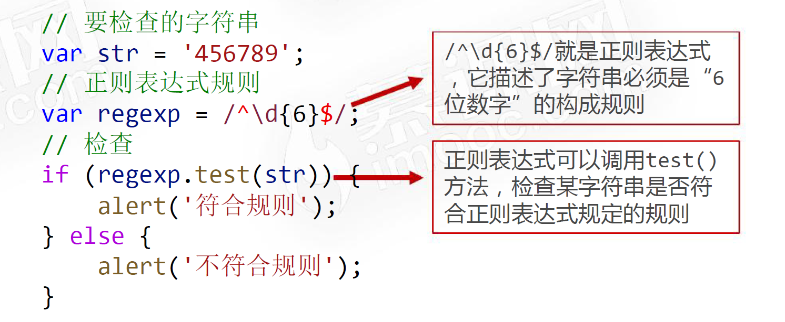
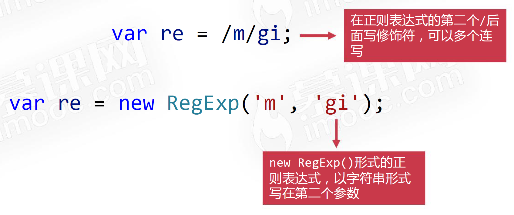
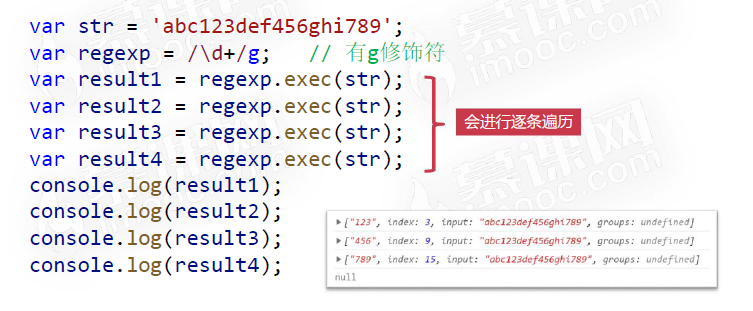
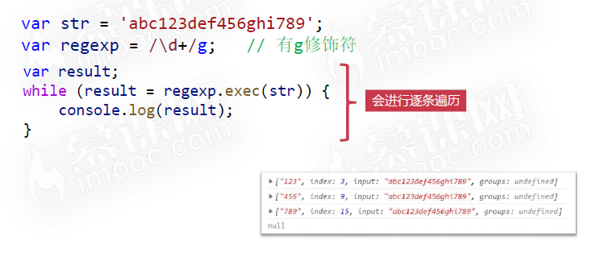

# 【正则表达式】

# 一、什么是正则表达式

正则表达式描述了字符串的 “构成模式”，经常被用于检查字符串是否符合预定的格式要求。

> 比如：验证手机号、验证邮箱、验证身份证……

## 1.1 快速感知正则表达式

用一个例子快速演示正则表达式基本使用方法：检查某个字符串是否是 6 位数字。



## 1.2 正则表达式“按位”描述规则

正则表达式“按位”描述规则，是指它是一位一位的描述字符串的构成形式。

比如检查字符串是不是这样的：以字母 m 开头，然后是 3 个数字，最后以字母 n 结尾。


# 二、正则表达式的使用

## 2.1 正则表达式的创建

- 使用 `/内容/` 的语法形式，可以快速创建正则表达式
- 也可以使用 `new RegExp('内容')` 的形式，创建正则表达式
- 使用 `typeof` 运算符检查正则表达式的类型，结果是 `object`

## 2.2 元字符

“元字符”是指一位指定类型的字符。

| 元字符 | 功能                                       |
| ------ | ------------------------------------------ |
| `\d`   | 匹配一个数字                               |
| `\D`   | 匹配一个非数字字符                         |
| `\w`   | 匹配一个单字字符（字母、数字或者下划线）   |
| `\W`   | 匹配一个非单字字符                         |
| `\s`   | 匹配一个空白字符，包括空格，制表符和换行符 |
| `.`    | 任意字符                                   |
| `^`    | 匹配开头                                   |
| `$`    | 匹配结尾                                   |

## 2.3 元字符注意事项

如果使用 `new RegExp()` 写法，反斜杆需要多写一个。

比如 `/^\d$/` 和 `new RegExp('^\\d$')` 是相同的意思。

## 2.4 元字符使用举例

某快递公司运单号形式是这样的：`123-4567-890`，请使用正则表达式检查某字符串是否符合此格式。

某产品的验证密钥是这样的：`□□□-□□□□-□□□`，其中 `□` 表示字母数字或者下划线，请使用正则表达式检查某字符串是否符合此格式。

## 2.5 字符的转义

在特殊字符之前的反斜杠 `\` 表示下一个字符不是特殊字符，应该按照字面理解。

- `/^.$/`：检查字符串是不是任意字符
- `/^\.$/`：检查字符串是不是一个点
- `/^\\$/`：检查字符串是不是一个反斜杠

不管一个符号有没有特殊意义，都可以在其之前加上一个 `\` 以确保它表达的是这个符号本身。

举例：某产品批号形式为：`123.45^67#89`，请使用正则表达式检查某字符串是否符合此格式。

## 2.6 方括号表示法

使用方括号，比如 `[xyz]`，可以创建一个字符集合，表示匹配方括号中的任意字符。

比如某学校的学号规定：第1位是一个字母，b表示本科生，y表示研究生，后面是7位数字，用正则表达式表示为：

`/^[by]\d{7}$/`

可以使用短横 `-` 来指定一个字符范围，`^` 表示否定。

| 元字符 | 等价的方括号表示法 |
| ------ | ------------------ |
| `\d`   | `[0-9]`            |
| `\D`   | `[^0-9]`           |
| `\w`   | `[A-Za-z0-9_]`     |
| `\W`   | `[^A-Za-z0-9_]`    |

## 2.7 方括号表示法小题目

- 题目1：请验证某字符串是否是5位字母，大小写均可
- 题目2：请验证某字符串是否是5位，且仅有小写字母、点构成
- 题目3：请验证某字符串是否是4位小写字母，且最后一位不能是 m 字母

## 2.8 量词

| 量词     | 意义                                                |
| -------- | --------------------------------------------------- |
| `*`      | 匹配前一个表达式 0 次或多次。等价于 `{0, }`         |
| `+`      | 匹配前面一个表达式 1 次或者多次。等价于 `{1, }`     |
| `?`      | 匹配前面一个表达式 0 次或者 1 次。等价于 `{0, 1}`   |
| `{n}`    | n 是一个正整数，匹配了前面一个字符刚好出现了 n 次   |
| `{n, }`  | n 是一个正整数，匹配前一个字符至少出现了 n 次       |
| `{n, m}` | n 和 m 都是整数。匹配前面的字符至少 n 次，最多 m 次 |

## 2.9 量词小题目

题目1：请验证字符串是否符合手机号码的规则：11 位数字，并且肯定以 1 开头。

题目2：请验证某字符串是否是这样的：以字母开头，中间是任意位数字（最少1位）构成，并以字母结尾。

题目3：请验证某字符串是否符合网址规则：以 `www.` 开头，中间是任意位的字符（字母数字下划线），最后以 `.com` 结尾，也可以以 `.com.cn` 结尾。

## 2.10 修饰符

修饰符也叫作标志（flags），用于使用正则表达式实现高级搜索。

| 修饰符 | 意义             |
| ------ | ---------------- |
| `i`    | 不区分大小写搜索 |
| `g`    | 全局搜索         |

【修饰符的使用】



# 三、正则表达式的应用

## 2.1 用正则表达式进行表单验证

- 用正则表达式进行表单验证是正则表达式最重要的实际应用
- 实际上，很多正则表达式不需要我们自己写，可以通过搜索引擎查找，可以拿来即用

# 四、正则表达式和字符串

## 4.1 正则表达式的相关方法

正则表达式可以“打点”调用哪些方法呢？

| 方法     | 简介                                                        |
| -------- | ----------------------------------------------------------- |
| `test()` | 测试某字符串是否匹配正则表达式，返回布尔值                  |
| `exec()` | 根据正则表达式，在字符串中进行查找，返回结果数组或者 `null` |

## 4.2 test()方法

正则表达式的 `test()` 方法用来测试某字符串是否匹配此正则表达式，它返回 `true` 或 `false`。

```javascript
/^[a-z]{3}[a-ln-z]$/.test('abcd')	// true
```

## 4.3 exec()方法

`exec()` 方法功能是：在一个指定字符串中执行一个搜索匹配查找，返回一个结果数组或 null。

```javascript
var str = 'abc123def456ghi789';
var regexp = /\d+/;
var result1 = regexp.exec(str);

// [ '123', index: 3, input: 'abc123def456ghi789', groups: undefined ]
```

## 4.4 exec()方法的逐条遍历

`exec()` 方法最有趣的是，有 `g` 修饰符的正则表达式将自动成为“有状态”的，这意味着可以对单个字符串中的多次匹配结果进行逐条的遍历。





## 4.5 字符串的相关方法

字符串有哪些方法可以使用正则表达式？

| 方法        | 简介                                                         |
| ----------- | ------------------------------------------------------------ |
| `search()`  | 在字符串中根据正则表达式进行查找匹配，返回首次匹配到的位置索引，测试不到则返回 -1 |
| `match()`   | 在字符串中根据正则表达式进行查找匹配，返回一个数组，找不到则返回 null |
| `replace()` | 使用替换字符串替换掉匹配到的字符串，可以使用正则表达式       |
| `split()`   | 分隔字符串为数组，可以使用正则表达式                         |

