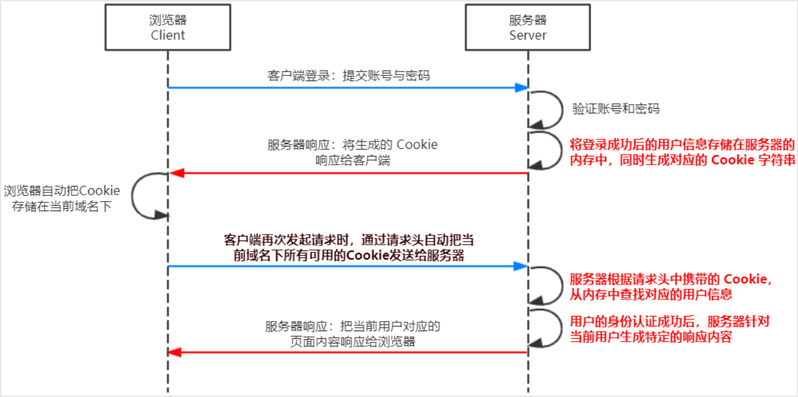
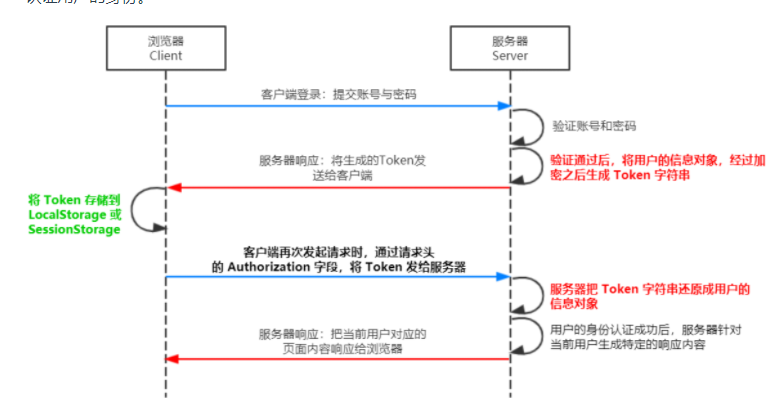

# 1. 初识 Node.js

***Node.js 是一个基于 Chrome V8 引擎的 JavaScript 运行环境。***  
  >Node.js 是一个基于Chrome JavaScript 运行时建立的一个平台。  
  Node.js是一个***事件驱动I/O***服务端JavaScript环境，基于Google的V8引擎，V8引擎执行Javascript的速度非常快，性能非常好。  

## Node.js 可以做什么
>Node.js 作为一个 JavaScript 的运行环境，仅仅提供了基础的功能和 API。然而，基于 Node.js 提供的这些基础能，很多强大
的工具和框架如雨后春笋，层出不穷，所以学会了 Node.js ，可以让前端程序员胜任更多的工作和岗位：  
      ① 基于 Express 框架（http://www.expressjs.com.cn/），可以快速构建 Web 应用  
      ② 基于 Electron 框架（https://electronjs.org/），可以构建跨平台的桌面应用  
      ③ 基于 restify 框架（http://restify.com/），可以快速构建 API 接口项目  
      ④ 读写和操作数据库、创建实用的命令行工具辅助前端开发

# 2. fs 文件系统模块
## 2.1 什么是 fs 文件系统模块
fs 模块是 Node.js 官方提供的、用来操作文件的模块。它提供了一系列的方法和属性，用来满足用户对文件的操作需求。

⚫ fs.readFile() 方法，用来读取指定文件中的内容  
 > fs.readFile(path[,options],callback)  
 * 参数1：必选参数，字符串，表示文件的路径。
 * 参数2：可选参数，表示以什么编码格式来读取文件。
 * 参数3：必选参数，文件读取完成后，通过回调函数拿到读取的结果。


⚫ fs.writeFile() 方法，用来向指定的文件中写入内容
>fs.writeFile(file,data[,options],callback)
  * 参数1：必选参数，需要指定一个文件路径的字符串，表示文件的存放路径。  
  * 参数2：必选参数，表示要写入的内容。  
  * 参数3：可选参数，表示以什么格式写入文件内容，默认值是 utf8。 ⚫ 参数4：必选参数，文件写入完成后的回调函数  


## 2.2 模式	说明  
* r	  读取文件，文件不存在抛异常  
* r+	读写文件，文件不存在抛异常  
* rs	同步模式下打开文件用于读取  
* rs+	同步模式下打开文件用于读写  
* w	  写文件，不存在则创建，存在则覆盖原有内容  
* wx	写文件，文件存在打开失败  
* w+	读写文件，不存在创建，存在截断  
* wx+	读写，存在打开失败  
* a	  追加，不存在创建  
* ax	追加，存在失败  
* a+	追加和读取，不存在创建  
* ax+	追加和读取，存在失败  

## 2.3 流式文件读取
简单文件读取的方式会一次性读取文件内容到内存  
若文件较大，会占用过多内存影响系统性能，且读取速度慢  
大文件适合用流式文件读取，它会分多次将文件读取到内存中
```
// 创建一个可读流
var rs = fs.createReadStream('./files/1.txt')
    // 创建一个可写流
var ws = fs.createWriteStream('./files/2.txt')

// 监听流的开启和关闭
// 这几个监听不是必须的
rs.once('open', function() {
    console.log('可读流打开了~~')
})

rs.once('close', function() {
    console.log('可读流关闭了~~')
        //数据读取完毕，关闭可写流
    ws.end()
})

ws.once('open', function() {
    console.log('可写流打开了~~')
})

ws.once('close', function() {
    console.log('可写流关闭了~~')
})

//要读取一个可读流中的数据，要为可读流绑定一个data事件，data事件绑定完毕自动开始读取数据
rs.on('data', function(data) {
    console.log(data)
        //将读取到的数据写入到可写流中
    ws.write(data)
})
```
## 简便写法
```
var fs = require('fs')

var rs = fs.createReadStream('C:/Users/lilichao/Desktop/笔记.mp3')
var ws = fs.createWriteStream('b.mp3')

// pipe()可以将可读流中的内容，直接输出到可写流中
rs.pipe(ws)
```

## 2.4 路径动态拼接问题 __dirname
在使用 fs 模块操作文件时，如果提供的操作路径是以 ./ 或 ../ 开头的相对路径时，容易出现路径动态拼接错误的问题  
原因：代码在运行的时候，会以执行 node 命令时所处的目录，动态拼接出被操作文件的完整路径  
解决方案：在使用 fs 模块操作文件时，直接提供完整的路径，从而防止路径动态拼接的问题  
***__dirname 获取文件所处的绝对路径***
```
fs.readFile(__dirname + '/files/1.txt', 'utf8', function(err, data) {
  ...
})
```

# 3.path 路径模块
path 模块是 Node.js 官方提供的、用来处理路径的模块。它提供了一系列的方法和属性，用来满足用户对路径的处理需求。

## 3.1 路径拼接 path.join()
## 3.2 获取路径中文件名 path.basename()
## 3.3 获取路径中文件名 path.basename()
```
const path = require('path')
const fs = require('fs')

// 路径拼接 path.join()
// 注意 ../ 会抵消前面的路径
// ./ 会被忽略

const pathStr = path.join('/a', '/b/c', '../../', './d', 'e')
console.log(pathStr);

fs.readFile(path.join(__dirname, './files/1.txt'), 'utf-8', function(err, data) {
    if (err) {
        return console.log(err.message);
    }
    console.log(data);
})

// 获取路径中的文件名 path.basename()
const fpath = './files/1.txt'

// const fullName = path.basename(fpath)
// console.log(fullName)

const nameWithoutExt = path.basename(fpath, '.txt')
console.log(nameWithoutExt)

// 获取路径中的文件扩展名 path.extname()
const fext = path.extname(fpath)
console.log(fext);
```
>① fs.writeFile() 方法只能用来创建文件，不能用来创建路径  
② 重复调用 fs.writeFile() 写入同一个文件，新写入的内容会覆盖之前的旧内容  

# 4.http 模块
## 4.1 网络知识
1. http 模块是 Node.js 官方提供的、用来创建 web 服务器的模块。    
2. 在网络节点中，负责消费资源的电脑，叫做客户端；负责对外提供网络资源的电脑，叫做服务器。    
3. IP 地址就是互联网上每台计算机的唯一地址，IP 地址的格式：通常用“点分十进制”表示成（a.b.c.d）的形式  
4. IP地址和域名是一一对应的关系，这份对应关系存放在一种叫做域名服务器(DNS，Domain name server)的电脑中。使用者
只需通过好记的域名访问对应的服务器即可，对应的转换工作由域名服务器实现。因此，域名服务器就是提供 IP 地址和域名
之间的转换服务的服务器
5. 每个 web 服务都对应一个唯一的端口号


## 4.2 创建基本 Web 服务器
>① 导入 http 模块  
② 创建 web 服务器实例  
③ 为服务器实例绑定 request 事件，监听客户端的请求  
④ 启动服务器    

### 4.2.1 req请求对象
只要服务器接收到了客户端的请求，就会调用通过 server.on() 为服务器绑定的 request 事件处理函数。  
```
server.on('request', function(req, res) {
    const url = req.url
    const method = req.method
    const str = `your request url is${url},and your method is${method}`
    console.log(str);
})
```
### 4.2.2 res响应对象
在服务器的 request 事件处理函数中，如果想访问与服务器相关的数据或属性  
```
server.on('request', function(req, res) {
    const url = req.url
    const method = req.method
    const str = `your request url is${url},and your method is${method}`
    res.end(str)
})
```

### 4.2.3 解决中文乱码问题
当调用 res.end() 方法，向客户端发送中文内容的时候，会出现乱码问题，此时，需要手动设置内容的编码格式：  
```
res.setHeader('Content-Type', 'text/html; charset=utf-8')
```

## 4.3 实现简陋路由效果（根据不同url响应不同html)
>① 获取请求的 url 地址  
② 设置默认的响应内容为 404 Not found  
③ 判断用户请求的是否为 / 或 /index.html 首页  
④ 判断用户请求的是否为 /about.html 关于页面  
⑤ 设置 Content-Type 响应头，防止中文乱码  
⑥ 使用 res.end() 把内容响应给客户端  
```
    if (url === '/' || url === '/index.html') {
        content = '<h1>首页</h1>'
    } else if (url === '/about.html') {
        content = '<h1>关于页面</h1>'
    }
```

# 5.模块化
## 5.1 什么是模块化
模块化是指解决一个复杂问题时，***自顶向下逐层把系统划分成若干模块的过程***。对于整个系统来说，模块是可组
合、分解和更换的单元
>① 提高了代码的复用性  
② 提高了代码的可维护性  
③ 可以实现按需加载   

## 5.2模块化规范
模块化规范就是对代码进行模块化的拆分与组合时，需要遵守的那些规则

## 5.3 nodejs的模块化
Node.js 中根据模块来源的不同，将模块分为了 3 大类，分别是：  
>⚫ 内置模块（内置模块是由 Node.js 官方提供的，例如 fs、path、http 等）  
⚫ 自定义模块（用户创建的每个 .js 文件，都是自定义模块）  
⚫ 第三方模块（由第三方开发出来的模块，并非官方提供的内置模块，也不是用户创建的自定义模块，使用前需要先下载）  

### 5.3.1 模块作用域
和函数作用域类似，在自定义模块中定义的变量、方法等成员，只能在当前模块内被访问，这种模块级别的访问限制，叫做模块
作用域。  
***好处：防止全局变量污染***

### 5.3.2 module对象
>1. 自定义模块中都有一个 module 对象，存储了和当前模块有关的信息  
>2. 在自定义模块中，可以使用 module.exports 对象，将模块内的成员共享出去，供外界使用。导入自定义模块时，得到的就是 module.exports 指向的对象。  
>3. 默认情况下，exports 和 module.exports 指向同一个对象。最终共享的结果，***以 module.exports 指向的对象为准***
>4. 外部使用require引入模块  

### 5.3.3 Node.js 中的模块化规范
Node.js 遵循了 CommonJS 模块化规范，CommonJS 规定了模块的特性和各模块之间如何相互依赖。  
CommonJS 规定：  
>① 每个模块内部，module 变量代表当前模块。  
>② module 变量是一个对象，它的 exports 属性（即 module.exports）是对外的接口。  
>③ 加载某个模块，其实是加载该模块的 module.exports 属性。require() 方法用于加载模块。

### 5.3.4模块加载机制
模块第一次加载后会被***缓存***，即多次调用 require() 不会导致模块的代码被执行多次，提高模块加载效率  

***最优先从缓存中找*** 
>1. 内置模块加载优先级最高。  

>2.  加载自定义模块时，路径要以 ./ 或 ../ 开头，否则会作为内置模块或第三方模块加载。

>导入自定义模块时，若省略文件扩展名，则 Node.js 会按顺序尝试加载文件：
>* 按确切的文件名加载
>* 补全 .js 扩展名加载
>* 补全 .json 扩展名加载
>* 补全 .node 扩展名加载
>* 报错

>3. 第三方模块加载
若导入第三方模块， Node.js 会从当前模块的父目录开始，尝试从 /node_modules 文件夹中加载第三方模块。  
如果没有找到对应的第三方模块，则移动到再上一层父目录中，进行加载，直到文件系统的根目录。  

>4. 目录作为模块加载
当把目录作为模块标识符进行加载的时候，有三种加载方式：  
  > * 在被加载的目录下查找 package.json 的文件，并寻找 main 属性，作为 require() 加载的入口  
  >* 如果没有 package.json 文件，或者 main 入口不存在或无法解析，则 Node.js 将会试图加载目录下的 index.js 文件。  
  >* 若失败则报错  


# 6.npm与包
## 6.1 包
Node.js 中的第三方模块又叫做包。  
包是基于内置模块封装出来的，提供了更高级、更方便的 API，极大的提高了开发效率。
## 6.2 包的来源
不同于 Node.js 中的内置模块与自定义模块，包是由第三方个人或团队开发出来的，免费供所有人使用。

## 6.3 包管理工具
这个包管理工具的名字叫做 Node Package Manager（简称 npm 包管理工具），这个包管理工具随着 Node.js 的安装包一起被安装到了用户的电脑上。

## 6.4 安装包
```
npm install 包名称
npm i 包名称
npm install @版本号
npm unstall 卸载
npm -g 全局
```

## 6.5 包配置信息
node_modules 文件夹用来存放所有已安装到项目中的包。require() 导入第三方包时，就是从这个目录中查找并加载包。  
package-lock.json 配置文件用来记录 node_modules 目录下的每一个包的下载信息，例如包的名字、版本号、下载地址等。

# 7 Express框架

## 7.1 什么是 Express
Express 是基于 Node.js 平台，快速、开放、极简的 Web 开发框架。  
Express 的作用和 Node.js 内置的 http 模块类似，是专门用来创建 Web 服务器的。  
Express 的本质：就是一个 npm 上的第三方包，提供了快速创建 Web 服务器的便捷方法。  

## 7.2 Express服务
### 7.2.1 创建基本web服务器

### 7.2.2 监听 GET POST请求
通过 app.get() 方法，可以监听客户端的 GET 请求  
通过 app.post() 方法，可以监听客户端的 POST 请求
```
//req包含请求对象的属性和方法
//res包含响应对象的属性和方法
//监听客户端的GET和POST请求，并向客户端响应具体的内容
app.get('/user', (req, res) => {
    res.send({ name: 'zs', age: 20, gender: '男' })
})

app.post('/user', (req, res) => {
    res.send('请求成功')
})
```

### 7.2.4 把内容响应给客户端
通过 res.send() 方法，可以把处理好的内容，发送给客户端

### 7.2.5 获取 URL 中携带的查询参数
通过 req.query 对象，可以访问到客户端通过查询字符串的形式，发送到服务器的参数
```
app.get('/', (req, res) => {
  // 通过 req.query 可以获取到客户端发送过来的 查询参数
  // 注意：默认情况下，req.query 是一个空对象
  console.log(req.query)
  res.send(req.query)
})
``` 
### 7.2.6  获取 URL 中的动态参数
通过 req.params 对象，可以访问到 URL 中，通过 : 匹配到的动态参数
```
app.get('/user/:ids/:username', (req, res) => {
  // req.params 是动态匹配到的 URL 参数，默认也是一个空对象
  console.log(req.params)
  res.send(req.params)
})
```

# 7.3 托管静态资源
* 通过 express.static() 方法可创建静态资源服务器，向外开放访问静态资源。  
* Express 在指定的静态目录中查找文件，并对外提供资源的访问路径，存放静态文件的目录名不会出现在 URL 中  
* 访问静态资源时，会根据托管顺序查找文件  
* 可为静态资源访问路径添加前缀  (如果希望在托管的静态资源访问路径之前，挂载路径前缀)

```
const express = require('express')
const app = express()

app.use('/files', express.static('../files'))
app.use('/clock', express.static('../clock'))

app.listen(80, () => {
    console.log('express server running at http://127.0.0.1')
})
```

# 7.4 Express 路由
路由就是映射关系。  
在 Express 中，路由指的是客户端的请求与服务器处理函数之间的映射关系。  
Express 中的路由分 3 部分组成，分别是***请求的类型、请求的 URL 地址、处理函数***  
```
app.METHOD(PATH,HANDLE)
``` 
## 7.4.1 路由匹配
每当一个请求到达服务器之后，需要先经过路由的匹配，只有匹配成功之后，才会调用对应的处理函数。  
在匹配时，会按照路由的顺序进行匹配，如果请求类型和请求的 URL 同时匹配成功，则 Express 会将这次请求，转
交给对应的 function 函数进行处理。  
>① 按照定义的先后顺序进行匹配  
② 请求类型和请求的URL同时匹配成功，
才会调用对应的处理函数  

## 7.4.2 模块化路由

为了方便对路由进行模块化的管理，Express 不建议将路由直接挂载到 app 上，而是推荐将路由抽离为单独的模块。  
>将路由抽离为单独模块的步骤如下：  
>① 创建路由模块对应的 .js 文件  
>② 调用 express.Router() 函数创建路由对象  
>③ 向路由对象上挂载具体的路由  
>④ 使用 module.exports 向外共享路由对象  
>⑤ 使用 app.use() 函数注册路由模块 
```
//创建路由模块
const express = require('express')

//创建路由对象
const router = express.Router()

//挂在具体路由
router.get('/user/list', (req, res) => {
    res.send('Get user list')
})

router.post('/user/add', (req, res) => {
    res.send('Add new user.')
})

// 向外导出路由对象
module.exports = router;
```
```
注册路由
const express = require('express')
const app = express()

// app.use('/files', express.static('./files'))

// 1. 导入路由模块
const router = require('./router')
    // 2. 注册路由模块
app.use('/api', router)

// 注意： app.use() 函数的作用，就是来注册全局中间件

app.listen(80, () => {
    console.log('http://127.0.0.1')
})
```

# 8 Express中间件
中间件（Middleware ），特指业务流程的中间处理环节。

## 8.1中间件概念
当一个请求到达 Express 的服务器之后，可以连续调用多个中间件，从而对这次请求进行预处理。  
Express 的中间件，本质上就是一个 function 处理函数（中间件函数的形参列表中，必须包含 next 参数。而）

## 8.2 next函数
next 函数是实现多个中间件连续调用的关键，它表示把流转关系转交给下一个中间件或路由。

## 8.3 全局中间件
客户端发起的任何请求，到达服务器之后，都会触发的中间件，叫做全局生效的中间件。  
通过调用 ***app.use(中间件函数)***，即可定义一个全局生效的中间件，

多个中间件之间，共享同一份 req 和 res。基于这样的特性，我们可以在上游的中间件中，统一为 req 或 res 对象添
加自定义的属性或方法，供下游的中间件或路由进行使用。  
```
// 定义第一个全局中间件
app.use((req, res, next) => {
        console.log('调用了第1个全局中间件')
        next()
    })
    // 定义第二个全局中间件
app.use((req, res, next) => {
    console.log('调用了第2个全局中间件')
    next()
})

app.get('/user', (req, res) => {
    res.send('User page.')
})

app.listen(80, () => {
    console.log('http://127.0.0.1')
})
```

## 8.4 局部中间件
局部生效的中间件  
***不使用*** app.use() 定义的中间件，叫做局部生效的中间件
```
// 定义中间件函数
const mw1 = (req, res, next) => {
    console.log('调用了第一个局部生效的中间件')
    next()
}

const mw2 = (req, res, next) => {
    console.log('调用了第二个局部生效的中间件')
    next()
}

// 两种定义局部中间件的方式
app.get('/hello', mw2, mw1, (req, res) => res.send('hello page.'))
app.get('/about', mw1, mw2, (req, res) => res.send('about page.'))

```
## 8.5 中间件注意事项
>* ① 一定要在路由之前注册中间件
>* ② 客户端发送过来的请求，可以连续调用多个中间件进行处理
>* ③ 执行完中间件的业务代码之后，不要忘记调用 next() 函数
>* ④ 为了防止代码逻辑混乱，调用 next() 函数后不要再写额外的代码
>* ⑤ 连续调用多个中间件时，多个中间件之间，共享 req 和 res 对象

## 8.6 中间件分类

### 1.应用级别的中间件
通过 app.use() 或 app.get() 或 app.post() ，绑定到 app 实例上的中间件
***全局和局部中间件就是***

### 2.路由级别的中间件
绑定到 express.Router() 实例上的中间件，叫做路由级别的中间件。用法和应用级别中间件没有区别。应用级别中间件是绑定到 app 实例上，路由级别中间件绑定到 router 实例上。
```
router.use(function(req, res, next) {
    console.log('Time', Date.now());
    next
})

app.use('/', router)
```

### 3.错误级别的中间件
* 用来捕获整个项目中发生的异常错误，从而防止项目异常崩溃的问题  
* 错误级别中间件的处理函数中，必须有 4 个形参，形参顺序从前到后分别是 (err, req, res, next) 。  
* 错误级别的中间件必须注册在***所有路由之后***  


### 4.Express 内置中间件
* express.static 快速托管静态资源的内置中间件，例如： HTML 文件、图片、CSS 样式等（无兼容性）  
* express.json 解析 JSON 格式的请求体数据（有兼容性，仅在 4.16.0+ 版本中可用）  
* express.urlencoded 解析 URL-encoded 格式的请求体数据（有兼容性，仅在 4.16.0+ 版本中可用）  
  
```
app.use(express.json())
app.use(express.urlencoded({ extended: false }))
```
### 5.第三方中间件
* ① 运行 npm install body-parser 安装中间件
* ② 使用 require 导入中间件
* ③ 调用 app.use() 注册并使用中间件


# 9.CORS 跨域资源共享
## cors 中间件解决跨域
```
安装中间件：npm install cors  
导入中间件：const cors = require('cors')  
配置中间件：app.use(cors)  
```
## 同协议，同域名，同端口
* CORS（Cross-Origin Resource Sharing，跨域资源共享）解决跨域，是通过 HTTP 响应头决定浏览器是否阻止前端 JS 代码跨域获取资源  
* 浏览器的同源安全策略默认会阻止网页“跨域”获取资源。但如果接口服务器配置了 CORS 相关的 HTTP 响应头，就可解除浏览器端的跨域访问限制  
* CORS 主要在服务器端进行配置。客户端浏览器无须做任何额外的配置，即可请求开启了 CORS 的接口。  
* CORS 在浏览器中有兼容性。只有支持 XMLHttpRequest Level2 的浏览器，才能正常访问开启了 CORS 的服务端接口（例如：IE10+、Chrome4+、FireFox3.5+）。

## 9.1 CORS 常见响应头
***Access-Control-Allow-Origin：制定了允许访问资源的外域 URL***
```
res.setHeader('Access-Control-Allow-Origin', 'http://bruceblog.io')
res.setHeader('Access-Control-Allow-Origin', '*')
```

* 默认情况下，CORS 仅支持客户端向服务器发送如下的 9 个请求头:Accept、Accept-Language、Content-Language、DPR、Downlink、Save-Data、Viewport-Width、Width 、Content-Type （值仅限于 text/plain、multipart/form-data、application/x-www-form-urlencoded 三者之一）
* 如果客户端向服务器发送了额外的请求头信息，则需要在服务器端，通过 Access-Control-Allow-Headers 对额外的请求头进行声明，否则这次请求会失败！
  ```
  res.setHeader('Access-Control-Allow-Headers', 'Content-Type, X-Custom-Header')
  ```

*** Access-Control-Allow-Methods***
* 默认情况下，CORS 仅支持客户端发起 GET、POST、HEAD 请求。
* 如果客户端希望通过 PUT、DELETE 等方式请求服务器的资源，则需要在服务器端，通过 * Access-Control-Alow-Methods 来指明实际请求所允许使用的 HTTP 方法
  ```
  res.setHeader('Access-Control-Allow-Methods', 'POST, GET, DELETE, HEAD')
  res.setHEader('Access-Control-Allow-Methods', '*')
  ```

## 9.2 CORS 请求分类
## 简单请求
* 请求方式：GET、POST、HEAD 三者之一  
* HTTP 头部信息不超过以下几种字段：无自定义头部字段、Accept、Accept-Language、Content-Language、DPR、Downlink、Save-Data、Viewport-Width、Width 、Content-Type（只有三个值 application/x-www-formurlencoded、multipart/form-data、text/plain）

## 预检请求
* 请求方式为 GET、POST、HEAD 之外的请求 Method 类型  
* 请求头中包含自定义头部字段  
* 向服务器发送了 application/json 格式的数据  

在浏览器与服务器正式通信之前，浏览器会先发送 OPTION 请求进行预检，以获知服务器是否允许该实际请求，所以这一次的 OPTION 请求称为“预检请求”。服务器成功响应预检请求后，才会发送真正的请求，并且携带真实数据

# 10 数据库操作
## 10.1配置 mysql 模块
* 安装 mysql 模块
* 建立连接
 ```
const mysql = require('mysql')
const db = mysql.createPool({
  host: '127.0.0.1',
  user: 'root',
  password: 'root',
  database: 'node',
})
```
* 测试是否正常工作
```
  db.query('select 1', (err, results) => {
  if (err) return console.log(err.message)
  console.log(results)
})
```

# 10.2 操作 mysql 数据库
* 查询数据
```
db.query('select * from users', (err, results) => {
  ...
})
```
* 插入数据
```
// ? 表示占位符
const sql = 'insert into users values(?, ?)'
// 使用数组的形式为占位符指定具体的值
db.query(sql, [username, password], (err, results) => {
  if (err) return console.log(err.message)
  if (results.affectedRows === 1) console.log('插入成功')
})
```
***向表中新增数据时，如果数据对象的每个属性和数据表的字段一一对应***
```
const user = {username:'Bruce', password:'55520'}
const sql = 'insert into users set ?'
db.query(sql, user, (err, results) => {
  ...
})
```
* 更新数据
```
const sql = 'update users set username=?, password=? where id=?'
db.query(sql, [username, password, id], (err, results) => {
  ...
})

const user = {id:7,username:'Bruce',password:'55520'}
const sql = 'update users set ? where id=?'
db.query(sql, [user, user.id], (err, results) => {
  ...
})
```
* 删除数据
```
const sql = 'delete from users where id=?'
db.query(sql, id, (err, results) => {
  ...
})
```
***使用 delete 语句会真正删除数据，保险起见，使用标记删除的形式，模拟删除的动作***

# 11 Web 开发模式

## 11.1 服务端渲染
服务器发送给客户端的 HTML 页面，是在服务器通过字符串的拼接动态生成的。因此客户端不需要使用 Ajax 额外请求页面的数据。
```
app.get('/index.html', (req, res) => {
  const user = { name: 'Bruce', age: 29 }
  const html = `<h1>username:${user.name}, age:${user.age}</h1>`
  res.send(html)
})
```

优点：
* 前端耗时短。浏览器只需直接渲染页面，无需额外请求数据。
* 有利于 SEO。服务器响应的是完整的 HTML 页面内容，有利于爬虫爬取信息。


缺点：
* 占用服务器资源。服务器需要完成页面内容的拼接，若请求比较多，会对服务器造成一定访问压力。
* 不利于前后端分离，开发效率低。

## 11.2 前后端分离
前后端分离的开发模式，依赖于 Ajax 技术的广泛应用。后端只负责提供 API 接口，前端使用 Ajax 调用接口。

优点：
* 开发体验好。前端专业页面开发，后端专注接口开发。
* 用户体验好。页面局部刷新，无需重新请求页面。
* 减轻服务器的渲染压力。页面最终在浏览器里生成。

缺点：
* 不利于 SEO。完整的 HTML 页面在浏览器拼接完成，因此爬虫无法爬取页面的  
* 有效信息。Vue、React 等框架的 SSR（server side render）技术能解决 SEO 问题。

# 选择
* 企业级网站，主要功能是展示，没有复杂交互，且需要良好的 SEO，可考虑服务端渲染  
* 后台管理项目，交互性强，无需考虑 SEO，可使用前后端分离  
* 为同时兼顾首页渲染速度和前后端分离开发效率，可采用首屏服务器端渲染+其他页面前后端分离的开发模式  


# 12 身份验证
Cookie 是存储在用户浏览器中的一段不超过 4 KB 的字符串。它由一个名称（Name）、一个值（Value）和其它几个用
于控制 Cookie 有效期、安全性、使用范围的可选属性组成。  
不同域名下的 Cookie 各自独立，每当客户端发起请求时，会自动把当前域名下所有未过期的 Cookie 一同发送到服务器。  
Cookie的几大特性：  
* ① 自动发送
* ② 域名独立
* ③ 过期时限
* ④ 4KB 限制  
***不安全，不要把隐私信息放到cookie中***
## 12.1 Session 认证机制
服务端渲染推荐使用 Session 认证机制

## Express 中使用 Session 认证

安装 express-session 中间件
```
npm install express-session
```
配置中间件
```
const session = require('express-session')
app.use(
  session({
    secret: 'Bruce', // secret 的值为任意字符串
    resave: false,
    saveUninitalized: true,
  })
)
```
向 session 中存数据
中间件配置成功后，可通过 req.session 访问 session 对象，存储用户信息
```
app.post('/api/login', (req, res) => {
  req.session.user = req.body
  req.session.isLogin = true

  res.send({ status: 0, msg: 'login done' })
})
```
从 session 取数据
```
app.get('/api/username', (req, res) => {
  if (!req.session.isLogin) {
    return res.send({ status: 1, msg: 'fail' })
  }
  res.send({ status: 0, msg: 'success', username: req.session.user.username })
})
```
清空 session
```
app.post('/api/logout', (req, res) => {
  // 清空当前客户端的session信息
  req.session.destroy()
  res.send({ status: 0, msg: 'logout done' })
})
```

## 12.2 JWT 认证机制
前后端分离推荐使用 JWT（JSON Web Token）认证机制，是目前最流行的跨域认证解决方案

## JWT 工作原理
Session 认证的局限性：

Session 认证机制需要配合 Cookie 才能实现。由于 Cookie 默认***不支持跨域访问***，所以，当涉及到前端跨域请求后端接口的时候，需要做很多额外的配置，才能实现跨域 Session 认证。  
* 当前端请求后端接口不存在跨域问题的时候，推荐使用 Session 身份认证机制。   
* 当前端需要跨域请求后端接口的时候，不推荐使用 Session 身份认证机制，推荐使用 JWT 认证机制


JWT 工作原理图：

用户的信息通过 Token 字符串的形式，保存在客户端浏览器中。服务器通过还原 Token 字符串的形式来认证用户的身份。

### JWT 组成部分：
* Header、Payload、Signature
* Payload 是真正的用户信息，加密后的字符串  
* Header 和 Signature 是安全性相关部分   
保证 Token 安全性三者使用 . 分隔

### JWT 使用方式：

* 客户端会把 JWT 存储在 localStorage 或 sessionStorage 中  
* 此后客户端与服务端通信需要携带 JWT 进行身份认证，将 JWT 存在 HTTP 请求头 Authorization 字段中  
* 加上 Bearer 前缀
```
Authorization: Bearer <token>
```

## Express JWT
1. 安装    
* jsonwebtoken 用于生成 JWT 字符串  
* express-jwt 用于将 JWT 字符串解析还原成 JSON 对象
```  
npm install jsonwebtoken express-jwt 
```

2. 定义 secret 密钥
* 为保证 JWT 字符串的安全性，防止其在网络传输过程中被破解，需定义用于加密和解密的 secret 密钥  
* 生成 JWT 字符串时，使用密钥加密信息，得到加密好的 JWT 字符串  
* 把 JWT 字符串解析还原成 JSON 对象时，使用密钥解密  
```
const jwt = require('jsonwebtoken')
const expressJWT = require('express-jwt')

// 密钥为任意字符串
const secretKey = 'Bruce'
```

3. 生成 JWT 字符串
```
app.post('/api/login', (req, res) => {
  ...
  res.send({
    status: 200,
    message: '登录成功',
    // jwt.sign() 生成 JWT 字符串
    // 参数：用户信息对象、加密密钥、配置对象-token有效期
    // 尽量不保存敏感信息，因此只有用户名，没有密码
    token: jwt.sign({username: userInfo.username}, secretKey, {expiresIn: '10h'})
  })
})
```

4. JWT 字符串还原为 JSON 对象 

* 客户端访问有权限的接口时，需通过请求头的 Authorization 字段，将 Token 字符串发送到服务器进行身份认证  
* 服务器可以通过 express-jwt 中间件将客户端发送过来的 Token 解析还原成 JSON 对象  


```
// unless({ path: [/^\/api\//] }) 指定哪些接口无需访问权限
app.use(expressJWT({ secret: secretKey }).unless({ path: [/^\/api\//] }))
```

5. 获取用户信息

当 express-jwt 中间件配置成功后，即可在那些有权限的接口中，使用 req.user 对象，来访问从 JWT 字符串中解析出来的用户信息

```
app.get('/admin/getinfo', (req, res) => {
  console.log(req.user)
  res.send({
    status: 200,
    message: '获取信息成功',
    data: req.user,
  })
})
```

6. 捕获解析 JWT 失败后产生的错误


当使用 express-jwt 解析 Token 字符串时，如果客户端发送过来的 Token 字符串过期或不合法，会产生一个解析失败的错误，影响项目的正常运行
通过 Express 的错误中间件，捕获这个错误并进行相关的处理

```
app.use((err, req, res, next) => {
  if (err.name === 'UnauthorizedError') {
    return res.send({ status: 401, message: 'Invalid token' })
  }
  res.send({ status: 500, message: 'Unknown error' })
})
```