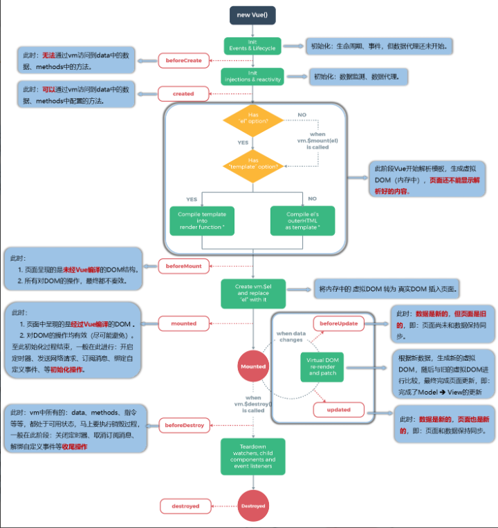
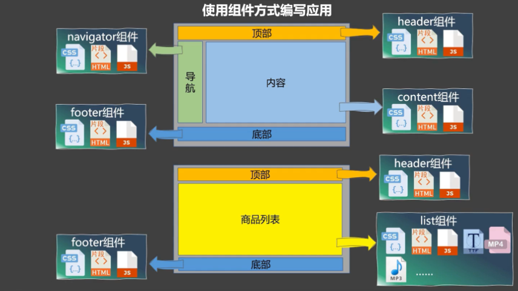

# Vue技术栈

## 第一章 Vue核心

### 1.1 Vue简介
***动态构建用户界面的渐进式javascript框架***
* 构建用户界面：把数据通过某种办法变成用户界面
* 渐进式：自底向上逐层应用，简单应用只需要一个小巧核心库 ，复杂应用引入各式各样的Vue插件


### 1.2 Vue特点
> 1. 遵循 MVVM 模式
> 2. 编码简洁，体积小，运行效率高，适合 移动/PC 端开发
> 3. 它本身只关注 UI，可以轻松引入 vue 插件或其它第三方库开发项目
> 4. 采用组件化模式，提高代码复用率、且让代码更好维护
> 5. 声明式编码，让编码人员无需直接操作DOM，提高开发效率
> 6. 使用虚拟DOM和Diff算法，尽量复用DOM节点

### 1.3 Vue体验
> 1. 想让Vue工作，就必须创建一个Vue实例，且要传入一个配置对象；
> 2. root容器里的代码依然符合html规范，只不过混入了一些特殊的Vue语法；
> 3. root容器里的代码被称为【Vue模板】；
> 4. Vue实例和容器是一一对应的；
> 5. 真实开发中只有一个Vue实例，并且会配合着使用；
> 6. {{xxx}}中的xxx要写js表达式，且xxx可以自data中的所有属性；
> 7. 一旦data中的数据发生改变，那么页面中用的地方也会自动更新；

```
    <!-- 准备一个容器 -->
    <div id="root">
        <h1>Hello,{{name}}</h1>
    </div>

    <script type="text/javascript">
        Vue.config.productionTip = false; //取消日志生成生产提示

        // 创建vue实例 传一个对象 配置对象
        const x = new Vue({
            el: '#root', //el用于指定当前Vue实例为哪个容器服务，值通常为css选择器
            data: {
                //data中用于存储数据，数据供el指定容器去使用 对象？函数
                name: 'Hello World'
            }
        })
```

### 1.4 模板语法

#### 插值语法
* 功能：用于解析标签体内容。
* 写法：{{xxx}}，xxx是js表达式，且可以直接读取到data中的所有属性。

#### 指令语法
* 功能：用于解析标签（包括：标签属性、标签体内容、绑定事件.....）。
* 举例：v-bind:href="xxx" 或  简写为 :href="xxx"，xxx同样要写js表达式，且可以直接读取到data中的所有属性。
* 备注：Vue中有很多的指令，且形式都是：v-????

```
 <div id="root">

        <h1>插值语法</h1>
        <h3>你好,{{name}}</h3>
        <h1>指令语法</h1>
        <a v-bind:href="school.url.toUpperCase()" v-bind:x="hello">点我{{school.name}}开冲</a>
        <a :href="school.url" :x="hello">点我开冲</a>
        <!-- 可以用:代替v-bind -->

    </div>

    <script>
        Vue.config.productionTip = false;
        new Vue({
            el: '#root',
            data: {
                name: '张三',
                school: {
                    url: 'http://www.baidu.com',
                    name: '华工'
                },
                hello: 'nm'
            }
        })
    </script>
```

### 1.5 数据绑定
Vue中有2种数据绑定的方式：
1. 单向绑定(v-bind)：数据只能从data流向页面。
2. 双向绑定(v-model)：数据不仅能从data流向页面，还可以从页面流向data。
> 备注：  
>* 1.双向绑定一般都应用在表单类元素上（如：input、select等）
>* 2.v-model:value 可以简写为 v-model，因为v-model默认收集的就是value值。
```
      单向数据绑定：<input type="text" v-bind:value="name">
        <br> 双向数据绑定：
        <input type="text" v-model:value="name">

        <!-- 报错 model只能用于表单类 有value值 -->
        <!-- <h2 v-model:x="name"></h2> -->

        <!-- 简写 -->
        单向数据绑定：<input type="text" :value="name">
        <br> 双向数据绑定：
        <input type="text" v-model="name">
```

### 1.6 	data与el的2种写法
1. el有2种写法  
	* (1).new Vue时候配置el属性。
	* (2).先创建Vue实例，随后再通过vm.$mount('#root')指定el的值。
2. data有2种写法
   * (1).对象式  
   * (2).函数式  
如何选择：目前哪种写法都可以，以后学习到组件时，data必须使用函数式，否则会报错。
3. 一个重要的原则：
	由Vue管理的函数，***一定不要写箭头函数***，一旦写了箭头函数，this就不再是Vue实例了。
```
  // const v = new Vue({
        //     // el: '#root',第一种写法
        //     data: {
        //         name: '你好'
        //     }
        // })
        // v.$mount('#root') //第二种写法

        //data两种写法
        new Vue({
            el: '#root',
            //第一种写法：对象式
            // data:{
            //   name:'你号'
            // }

            //第二种写法 函数式
            data: function() {
                console.log('@@@', this); //this指向Vue实例对象
                return {
                    name: '哈哈'
                }
            }
        })
```

### 1.7 MVVM模型

***MVVM模型***
1. M：模型(Model) ：data中的数据
2. V：视图(View) ：模板代码
3. VM：视图模型(ViewModel)：Vue实例  
>* 1.data中所有的属性，最后都出现在了vm身上。
>* 2.vm身上所有的属性 及 Vue原型上所有属性，在Vue模板中都可以直接使用。


### 1.8 数据代理
Object.defineproperty方法  
```
<script>
        let number = 18
        let person = {
            name: 'z3',
            sex: '男'
        }

        //这个定义的不参与遍历 不可枚举
        Object.defineProperty(person, 'age', {
            // value: 18
            // enumerable:true, //控制属性是否可以枚举，默认值是false
            // writable:true, //控制属性是否可以被修改，默认值是false
            // configurable:true //控制属性是否可以被删除，默认值是false

            // 当有人读取这个属性就会调用Get
            get() {
                console.log('有人读取age属性了')
                return number
            },

            //当有人修改person的age属性时，set函数(setter)就会被调用，且会收到修改的具体值
            set(value) {
                console.log('有人修改了age属性,且值是', value)
                number = value
            }
        })
        console.log(person);
```

***通过一个对象代理对另一个对象的属性进行读写操作***
```
 // 通过一个对象代理对另一个对象的属性进行读写操作
        let obj = {
            x: 100
        }
        let obj2 = {
            y: 100
        }

        Object.defineProperty(obj2, 'x', {
            get() {
                return obj.x
            },

            set(v) {
                obj.x = v
            }
        })
```

1. Vue中的数据代理：
通过vm对象来代理data对象中属性的操作（读/写）
2. Vue中数据代理的好处：
更加方便的操作data中的数据
3. 基本原理：
通过Object.defineProperty()把data对象中所有属性添加到vm上。
为每一个添加到vm上的属性，都指定一个getter/setter。
在getter/setter内部去操作（读/写）data中对应的属性。

***Vue将data中的数据拷贝了一份到_data属性中，又将_data里的属性提到Vue实例中，通过defineProperty实现数据代理，通过getter/setter操作name从而操作—_data中的name，而_data又对data进行数据劫持，实现响应式***

### 1.9 事件处理

* 事件的基本使用：  
	>1.使用v-on:xxx 或 @xxx 绑定事件，其中xxx是事件名；  
	>2.事件的回调需要配置在methods对象中，最终会在vm上；  
	>3.methods中配置的函数，不要用箭头函数！否则this就不是vm了；   
	>4.methods中配置的函数，都是被Vue所管理的函数，this的指向是vm 或 组件实例对象；    
	>5.@click="demo" 和 @click="demo($event)" 效果一致，但后者可以传参；   

```
   <!-- 准备好一个容器-->
    <div id="root">
        <h2>欢迎来到{{name}}学习</h2>

        <!-- <button v-on:click="showInfo">点我提示信息</button> -->

        <!-- 简写 -->
        <button @click="showInfo1">不传参</button>

        <!-- $event给事件event占位 -->
        <button @click="showInfo2($event,66)">传参</button>
    </div>
</body>

<script type="text/javascript">
    Vue.config.productionTip = false //阻止 vue 在启动时生成生产提示。

    const vm = new Vue({
        el: '#root',
        data: {
            name: '华工',
        },
        methods: {
            showInfo1(event) {
                console.log(event.target.innerText)
                console.log(this) //此处的this是vm
                alert('函数1')
            },
            showInfo2(event, number) {
                console.log(event, number)
                    // console.log(event.target.innerText)
                    // console.log(this) //此处的this是vm
                alert('华工2')
            }
        }
    })
```

*	Vue中的事件修饰符：
	1. prevent：阻止默认事件（常用）；
	2. stop：阻止事件冒泡（常用）；
	3. once：事件只触发一次（常用）；
	4. capture：使用事件的捕获模式；
	5. self：只有event.target是当前操作的元素时才触发事件；
	6. passive：事件的默认行为立即执行，无需等待事件回调执行完毕；
***可以连写***

* 键盘事件
1. Vue中常用的按键别名：
							回车 => enter
							删除 => delete (捕获“删除”和“退格”键)
							退出 => esc
							空格 => space
							换行 => tab (特殊，必须配合keydown去使用)
							上 => up
							下 => down
							左 => left
							右 => right

2. Vue未提供别名的按键，可以使用按键原始的key值去绑定，但注意要转为kebab-case（短横线命名）
3. 系统修饰键（用法特殊）：ctrl、alt、shift、meta
	* (1).配合keyup使用：按下修饰键的同时，再按下其他键，随后释放其他键，事件才被触发。
	* (2).配合keydown使用：正常触发事件。
4. 也可以使用keyCode去指定具体的按键（不推荐）
5. Vue.config.keyCodes.自定义键名 = 键码，可以去定制按键别名

***keydown.ctrl.a***连写指定ctrl+a

### 1.10 计算属性：computed
1. 定义：要用的属性不存在，要通过已有属性计算得来。
2. 原理：底层借助了Objcet.defineproperty方法提供的getter和setter。
3. get函数什么时候执行？
	* (1).初次读取时会执行一次。
	* (2).当依赖的数据发生改变时会被再次调用。
4. 优势：与methods实现相比，内部有缓存机制（复用），效率更高，调试方便。
5. 备注：
		1.计算属性最终会出现在vm上，直接读取使用即可。
		2.如果计算属性要被修改，那必须写set函数去响应修改，且set中要引起计算时依赖的数据发生改变。


### 1.11 监视属性：watch
1. 当被监视的属性变化时, 回调函数自动调用, 进行相关操作
2. 监视的属性必须存在，才能进行监视！！
3. 监视的两种写法：
	* (1).new Vue时传入watch配置
	* (2).通过vm.$watch监视
  
```
 // watch: {
        //    isHot: {
        //         // immediate:true, //初始化时让handler调用一下
        //         //计算属性computed也能监视到
        //         //isHot改变时调用
        //         handler(newValue, oldValue) {
        //             console.log('修改了isHot', newValue, oldValue);
        //         }
        //     }
        // }
    })
    vm.$watch('isHot', {
        // immediate:true, //初始化时让handler调用一下
        //计算属性computed也能监视到
        handler(newValue, oldValue) {
            console.log('修改了isHot', newValue, oldValue);
        }
    })
```

***深度监视***
```
  watch: {
                //监视多级结构中某个属性的变化
                // 'numbers.a': {
                //     handler() {
                //         console.log('a被改变了');
                //     }
                // }
                //对象的值是整个地址 监视不到 除非深度监视 	//监视多级结构中所有属性的变化
                numbers: {
                    deep: true,
                    handler() {
                        console.log('number改变了');
                    }
                }
            }

        //正常写法
		/* vm.$watch('isHot',{
			immediate:true, //初始化时让handler调用一下
			deep:true,//深度监视
			handler(newValue,oldValue){
				console.log('isHot被修改了',newValue,oldValue)
			}
		}) */

		//简写
		/* vm.$watch('isHot',(newValue,oldValue)=>{
			console.log('isHot被修改了',newValue,oldValue,this)
		}) */
```

***computed和watch的区别***
1. computed能完成的功能，watch都可以完成。
2. watch能完成的功能，computed不一定能完成，例如：watch可以进行异步操作。
两个重要的小原则：  
1. 所被Vue管理的函数，最好写成普通函数，这样this的指向才是vm 或 组件实例对象。
2. 所有不被Vue所管理的函数（定时器的回调函数、ajax的回调函数等、Promise的回调函数），最好写成箭头函数，这样this的指向才是vm 或 组件实例对象。
```
watch: {
        //     firstName(newValue, oldValue) {
        // 这里的定时器采用箭头函数this指向FirstName的this 也就是vm
        //         setTimeout(() => {
        //             this.fullName = newValue + this.lastName
        //         }, 1000);

        //     },
        //     lastName(val) {
        //         this.fullName = this.firstName + val;
        //     }
        // }
        // computed: {
        //     fullName() {
        //         console.log('被调用咯');
        //         return this.firstName + this.lastName
        //     }
        // }
```


### 1.12绑定样式
1. class样式
	* 写法:class="xxx" xxx可以是字符串、对象、数组。
	* 字符串写法适用于：类名不确定，要动态获取。
	* 对象写法适用于：要绑定多个样式，个数不确定，名字也不确定。
	* 数组写法适用于：要绑定多个样式，个数确定，名字也确定，但不确定用不用。
1. style样式
   * :style="{fontSize: xxx}"其中xxx是动态值。
   * :style="[a,b]"其中a、b是样式对象。

### 1.13 条件渲染
1. v-if  
    写法：  
	* (1).v-if="表达式" 
	* (2).v-else-if="表达式"
	* (3).v-else="表达式"  
		适用于：切换频率较低的场景 。  
		特点：不展示的DOM元素直接被移除。  
		注意：v-if可以和:v-else-if、v-else一起使用，但要求结构不能被“打断”。  

2. v-show  
		写法：v-show="表达式"  
		适用于：切换频率较高的场景。  
		特点：不展示的DOM元素未被移除，仅仅是使用样式隐藏掉  
								
3. 备注：使用v-if的时，元素可能无法获取到，而使用v-show一定可以获取到。（template只能与v-if使用）

### 1.14 列表渲染
#### v-for指令:
1. 用于展示列表数据
2. 语法：v-for="(item, index) in xxx" :key="yyy"
3. 可遍历：数组、对象、字符串（用的很少）、指定次数（用的很少）
```
<div id="root">
        <!-- 遍历数组 -->(多)
        <h2>人员列表</h2>
        <ul>
            <li v-for="(p,index) in persons" :key="index">{{p.name}}-{{p.age}}</li>
        </ul>

        <!-- 遍历对象 -->（多）
        <h2>汽车信息</h2>
        <ul>
            <li v-for="(val,k) in car" :key="k">
                {{k}}-{{val}}
            </li>
        </ul>

        <!-- 遍历字符串 -->
        <h2>测试字符串</h2>
        <ul>
            <li v-for="(char,index) in str" :key="index">
                {{char}}--{{index}}
            </li>
        </ul>

        <!-- 遍历指定次数 -->
        <h2>指定次数遍历</h2>
        <ul>
            <li v-for="(number,index) of 3" :key="index">
                {{number}}--{{index}}
            </li>
        </ul>
```
#### key原理
面试题：react、vue中的key有什么作用？（key的内部原理）

***不写key默认是index***		

1. 虚拟DOM中key的作用：  
	* key是虚拟DOM对象的标识，当数据发生变化时，Vue会根据【新数据】生成【新的虚拟DOM】, 随后Vue进行【新虚拟DOM】与【旧虚拟DOM】的差异比较，比较规则如下：
										
2. 对比规则：  
	* (1).旧虚拟DOM中找到了与新虚拟DOM相同的key：
		* ①.若虚拟DOM中内容没变, 直接使用之前的真实DOM！
		* ②.若虚拟DOM中内容变了, 则生成新的真实DOM，随后替换掉页面中之前的真实DOM。

	* (2).旧虚拟DOM中未找到与新虚拟DOM相同的key
		* 创建新的真实DOM，随后渲染到到页面。
												
3. 用index作为key可能会引发的问题：
   * 若对数据进行：逆序添加、逆序删除等破坏顺序操作:
   * 会产生没有必要的真实DOM更新 ==> 界面效果没问题, 但效率低。
   * 如果结构中还包含输入类的DOM：会产生错误DOM更新 ==> 界面有问题。
   * 
4. 开发中如何选择key?:  
	* 1.最好使用每条数据的唯一标识作为key, 比如id、手机号、身份证号、学号等唯一值。  
	* 2.如果不存在对数据的逆序添加、逆序删除等破坏顺序操作，仅用于渲染列表用于展示,使用index作为key是没有问题的。

#### 列表过滤
```
 // watch: {
            //     keyWord: {
            //         immediate: false,
            //         handler(val) {
            //             //字符串包含空字符串
            //             this.filPersons = this.persons.filter((p) => {
            //                 return p.name.indexOf(val) !== -1
            //                     // return p.name.includes(val)
            //             })
            //         }
            //     }
            // },
            computed: {
                filPersons() {
                    return this.persons.filter((p) => {
                        return p.name.indexOf(this.keyWord) !== -1
                            // return p.name.includes(val)
                    })
                }
            }
        })
```

#### 列表排序
```
  filPersons() {
      const arr = this.persons.filter((p) => {
       return p.name.indexOf(this.keyWord) !== -1
        // return p.name.includes(val)
    })
      if (this.sortType) { //升序 前减后 // 降序后减前
         arr.sort((a, b) => {
            return this.sortType === 1 ? b.age - a.age : a.age - b.age;
          })
      }
      return arr
   }
}
```

#### Vue监视数据的原理

1. vue会监视data中所有层次的数据。
2. 如何监测对象中的数据？
  * 通过setter实现监视，且要在new Vue时就传入要监测的数据。
	* 	(1).对象中后追加的属性，Vue默认不做响应式处理
	* 	(2).如需给后添加的属性做响应式，请使用如下API：
	* 	Vue.set(target，propertyName/index，value) 或 vm.$set(target，propertyName/index，value)  

3. 如何监测数组中的数据？
	* 通过包裹数组更新元素的方法实现，本质就是做了两件事：
	* (1).调用原生对应的方法对数组进行更新。
	* (2).重新解析模板，进而更新页面。

4. 在Vue修改数组中的某个元素一定要用如下方法：
   * 1.使用这些API:push()、pop()、shift()、unshift()、splice()、sort()、reverse()  因为这些属性挂载上了set get实现响应式
      * Vue检测数组是通过包裹数组的变更函数来实现
	* 2.Vue.set() 或 vm.$set() 不能对VUe根数据进行操作 data
				
***特别注意：Vue.set() 和 vm.$set() 不能给vm 或 vm的根数据对象 添加属性！！！***


#### 1.12 收集表单数据
收集表单数据：
```
若：<input type="text"/>，则v-model收集的是value值，用户输入的就是value值。  
若：<input type="radio"/>，则v-model收集的是value值，且要给标签配置value值。  
若：<input type="checkbox"/>  
	1.没有配置input的value属性，那么收集的就是checked（勾选 or 未勾选，是布尔值）
	  2.配置input的value属性:  
					(1)v-model的初始值是非数组，那么收集的就是checked（勾选 or 未勾选，是布尔值）  
					(2)v-model的初始值是数组，那么收集的的就是value组成的数组  
		备注：v-model的三个修饰符：
						lazy：失去焦点再收集数据  
						number：输入字符串转为有效的数字  
					    trim：输入首尾空格过滤  
```  

#### 1.13 过滤器(Vue3已移除)
定义：对要显示的数据进行特定格式化后再显示（适用于一些简单逻辑的处理）。  
语法：
1. 注册过滤器：Vue.filter(name,callback) 或 new Vue{filters:{}}
2. 使用过滤器：{{ xxx | 过滤器名}}  或  v-bind:属性 = "xxx | 过滤器名"
备注：
1. 过滤器也可以接收额外参数、多个过滤器也可以串联
2. 并没有改变原本的数据, 是产生新的对应的数据


#### 1.14 内置指令
1. v-text指令：
   * 1.作用：向其所在的节点中渲染文本内容。
   * 2.与插值语法的区别：v-text会替换掉节点中的内容，{{xx}}则不会。

2. 	v-html指令：
    * 1.作用：向指定节点中渲染包含html结构的内容。
    * 2.与插值语法的区别：
	     * (1).v-html会替换掉节点中所有的内容，{{xx}}则不会。
	     * (2).v-html可以识别html结构。
    * 3.严重注意：v-html有安全性问题！！！！
      * (1).在网站上动态渲染任意HTML是非常危险的，容易导致XSS攻击。
      * (2).一定要在可信的内容上使用v-html，永不要用在用户提交的内容上！

3. v-cloak指令（没有值）：
	* 1.本质是一个特殊属性，Vue实例创建完毕并接管容器后，会删掉v-cloak属性。
	* 2.使用css配合v-cloak可以解决网速慢时页面展示出{{xxx}}的问题。
```
<style>
    [v-cloak] {
        display: none;
    }
</style>

<div id="root">
    <h2 v-cloak>{{ name }}</h2>
</div>

// 够延迟5秒收到vue.js
<script type="text/javascript" src="http://localhost:8080/resource/5s/vue.js"></script>
```

4. v-once指令：
	* 1.v-once所在节点在初次动态渲染后，就视为静态内容了。
	* 2.以后数据的改变不会引起v-once所在结构的更新，可以用于优化性能。

5. 	v-pre指令：
	* 1.跳过其所在节点的编译过程。
	* 2.可利用它跳过：没有使用指令语法、没有使用插值语法的节点，会加快编译。


#### 1.15 自定义指令
* 自定义指令总结：
	* 一、定义语法：
		* (1).局部指令：  
    	    *  new Vue({directives:{指令名:配置对象}  或  irectives{指令名:回调函数}})


		* (2).全局指令：  
    		  * Vue.directive(指令名,配置对象) 或   Vue.directive(指令名,回调函数)

	* 二、配置对象中常用的3个回调：
		* (1).bind：指令与元素成功绑定时调用。
		* (2).inserted：指令所在元素被插入页面时调用。
		* (3).update：指令所在模板结构被重新解析时调用。

	* 三、备注：
		* 1.指令定义时不加v-，但使用时要加v-；
		* 2.指令名如果是多个单词，要使用kebab-case命名方式(要用引号括住），不要用camelCase命名。
```
<div id="root">
        <h2>当前的n值为:<span v-text='n'></span></h2>
        <h2>放大10倍后的n值为:<span v-big='n'></span></h2>
        <button @click="n++">点我n+1</button>

        <input type="text" v-fbind:value="n">
    </div>

    <div id="root2">
        <input type="text" v-fbind:value="x">
    </div>
    <script>
        Vue.config.productionTip = false;
        //定义全局指令
        /* Vue.directive('fbind',{
        	//指令与元素成功绑定时（一上来）
        	bind(element,binding){
        		element.value = binding.value
        	},
        	//指令所在元素被插入页面时
        	inserted(element,binding){
        		element.focus()
        	},
        	//指令所在的模板被重新解析时
        	update(element,binding){
        		element.value = binding.value
        	}
        }) */


        new Vue({

            el: '#root',
            data: {
                n: 1
            },
            directives: {
                //指令与元素成功绑定时会被调用
                // 指令所在的模板倍重新解析时
                big(element, binding) {
                    element.innerText = binding.value * 10
                },

                // fbind: {
                //     // 指令与元素成功绑定时调用
                //     bind(element, binding) {
                //         console.log('big', this) //注意此处的this是window
                //         element.value = binding.value
                //     },
                //     //指令所在元素被插入页面时
                //     inserted(element, binding) {
                //         console.log('inserted');
                //         element.focus()
                //     },
                //     //指令所在模板被重新解析
                //     update(element, binding) {
                //         console.log('update');
                //         element.value = binding.value
                //     }
                // }
            }
        })

        new Vue({
            el: '#root2',
            data: {
                x: 1
            }
        })
```

### 1.16 生命周期
* 生命周期：
  * 1.又名：生命周期回调函数、生命周期函数、生命周期钩子。
  * 2.是什么：Vue在关键时刻帮我们调用的一些特殊名称的函数。
  * 3.生命周期函数的名字不可更改，但函数的具体内容是程序员根据需求编写的。
  * 4.生命周期函数中的this指向是vm 或 组件实例对象。


***具体***  
> beforeCreate:生命周期，事件，数据代理还没开始，无法访问data和method的东西     
> created:数据监测，数据代理，可以访问data和method中的东西  
> beforeMount:开始解析模板，生成虚拟DOM(内存中)，未经编译的DOM结构，对DOM的操作都无效  
> mounted:将虚拟DOM转为真实DOM插入页面,呈现经过编译的DOM，对DOM的操作有效  
> beforeUpdate:数据是新的，页面时旧的，数据页面不同步  
> updated:新虚拟DOM和旧虚拟DOM比较，完成model->view的更新，数据和页面都是新的  
> beforeDestroy:所有的data,methods指令都处于可用状态，马上执行销毁  
> destroy：完全销毁一个实例vm，清理它与其他实例的连接，解除它的全部指令和自定义事件监听器（而不是dom事件）  

常用的生命周期钩子：  
* 1.mounted: 发送ajax请求、启动定时器、绑定自定义事件、订阅消息等【初始化操作】。
* 2.beforeDestroy: 清除定时器、解绑自定义事件、取消订阅消息等【收尾工作】。

关于销毁Vue实例  
* 1.销毁后借助Vue开发者工具看不到任何信息。
* 2.销毁后自定义事件会失效，但原生DOM事件依然有效。
* 3.一般不会在beforeDestroy操作数据，因为即便操作数据，也不会再触发更新流程了。

## 2 组件化编程

### 2.1 模块与组件、模块化与组件化

> 模块：向外提供特定功能的js，通过复用、简化js的编写，提高js运行效率
> 组件：用来实现局部功能的代码和资源的集合，复用编码，简化项目编码，提高运行效率
> 模块化：当应用中的js都以模块来编写，那应用就是一个模块化应用
> 组件化：当应用中的功能都是多组件的方式来编写的，那这个应用就是一个组件化的应用

### 2.2 非单文件组件
* 非单文件组件：一个文件中包含有n个组件
* 单文件组件：一个文件中只包含有一个组件